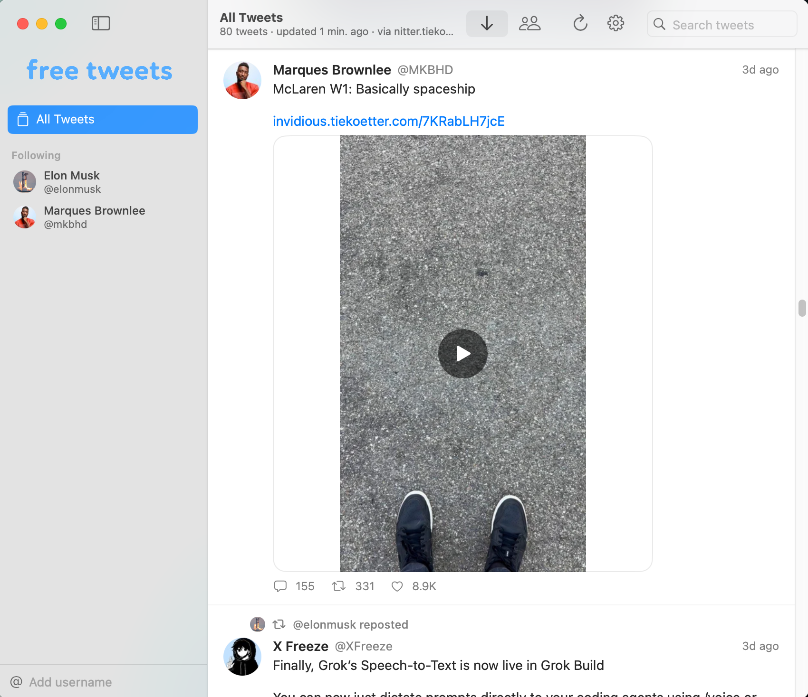
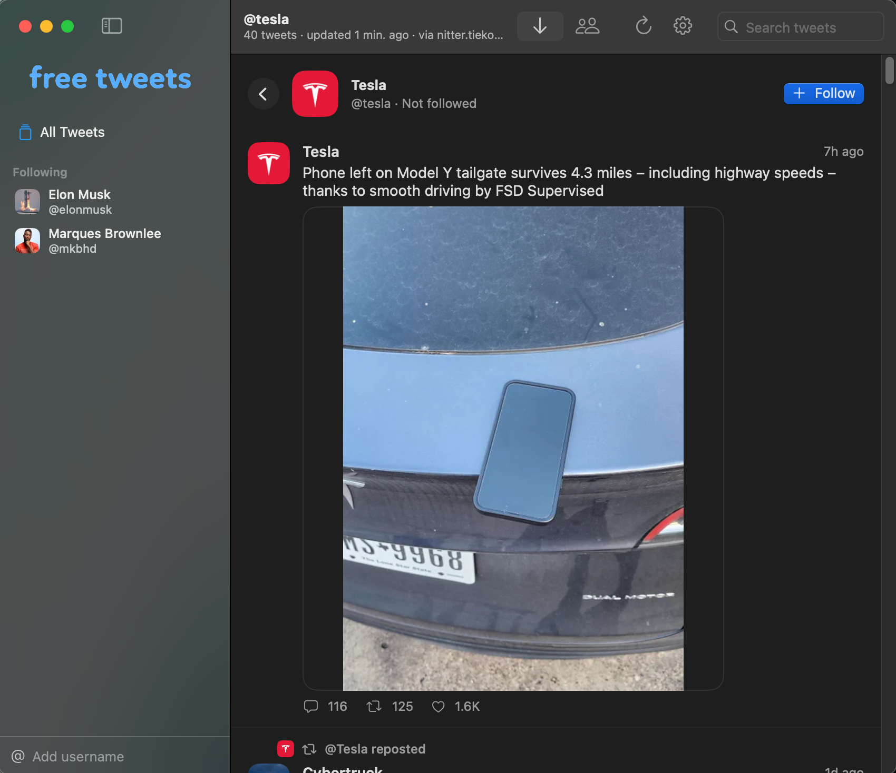
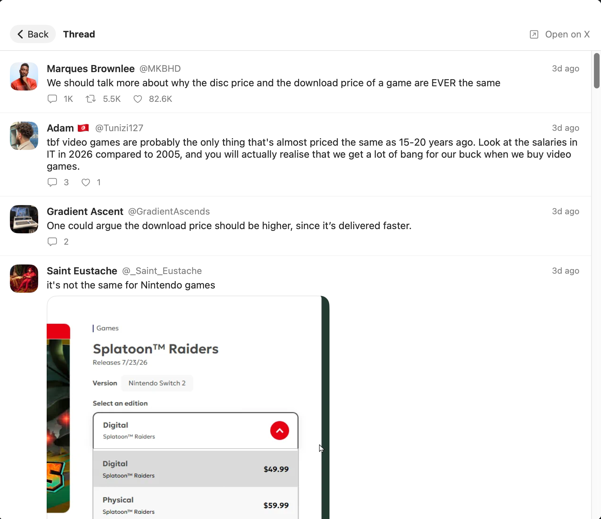
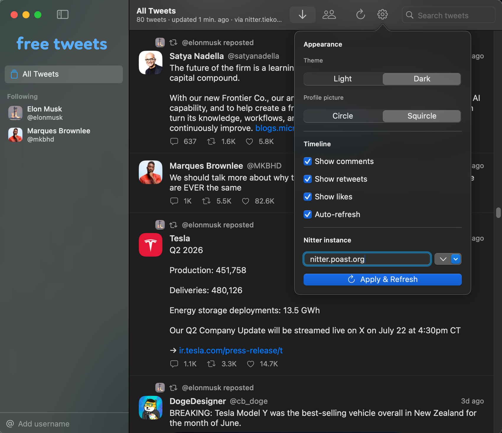

# FreeTweets

A free, open-source, private way to read X (Twitter) without an account or algorithm.

FreeTweets is a native macOS app for following X/Twitter accounts as a pure, non-algorithmic
timeline. You choose who to follow; FreeTweets aggregates their posts into one feed.
There is no ranking, "For You,", engagement math, no ads, and no login.
Nothing you read is sent anywhere except the request needed to fetch it.

FreeTweets exists so you can read the people you actually chose to
follow, on your own terms, with nothing collected along the way.

## How it works

FreeTweets never talks to Twitter/X directly and never needs an X account, API key, or login.
Instead it reads through [Nitter](https://github.com/zedeus/nitter), an open-source, privacy-respecting front end for Twitter, pulling each followed account's RSS feed and timeline pages for older posts.
Public Nitter instances vary in what they serve at any given time, so FreeTweets fetches feeds and
timeline pages independently from whichever instance actually serves them, and lets you switch
instances at any time in Settings.

None of your follows, settings, or reading history ever leave your Mac. There is no account,
no server, and no telemetry, everything is stored locally in your app preferences.

## Features

- **Follow accounts** by username (paste a handle or a full `x.com/…` URL) — no login required.
- **Unified timeline** across everyone you follow, or filter to one account in the sidebar.
- **In-app threads** — tap a post to read the full conversation (ancestors + replies) without
  leaving the app.
- **Photos, GIFs, and video** play in-app; media loads straight from Twitter's CDN.
- **Manual ordering only** — Newest or By account. That's the whole "algorithm."
- **Search** your timeline by text, name, or handle.
- **Light / Dark themes**, and circle or squircle profile pictures.
- **Configurable Nitter instance**, with automatic failover so the app keeps working as
  instances come and go.
- Clean, native SwiftUI, built for macOS. Click a post to open it on X; right-click to copy.
- Follows and settings persist locally between launches. Nothing is ever uploaded.

## Screenshots

 
 

## About Nitter instances (important)

Nitter instances rate-limit, gate, or disappear over time — that's the tradeoff of a project that
doesn't depend on Twitter's blessing. If posts stop loading:

1. Open **Settings** and pick a different instance from the menu, or type your own.
2. Click **Apply & Refresh**.

The instance ecosystem has split: some hosts serve RSS but wall their HTML pages, others serve HTML
but block RSS. FreeTweets fetches **RSS and HTML pages independently**, each from the first instance
that serves it so feeds, threads, and engagement counts keep working even when no single instance
offers everything. All requests use the User-Agent **`FreeTweets/1.0 (RSS Reader)`** a plain
RSS-client agent that passes several anti-bot walls which challenge browser-style agents. Images
load directly from Twitter's CDN (`pbs.twimg.com`) rather than through the instances' rate-limited
proxies. If an instance requires whitelisting (e.g. `xcancel.com`), email them to whitelist that
exact User-Agent. The sidebar shows a ⚠︎ next to any account whose feed is gated or failing, with
the reason on hover.

## Contributing

Issues and pull requests are welcome. This is a small, community project, not a company —
if a Nitter instance breaks something or you want a feature, open an issue.

## Disclaimer

FreeTweets is not affiliated with, endorsed by, or connected to X Corp/Twitter in any way.
It reads publicly available posts through third-party Nitter instances that FreeTweets does not
operate or control; their availability and reliability are outside this project's control.

## License

FreeTweets is Free Software, licensed under the
[GNU Affero General Public License v3.0](LICENSE). You are free to use, study, modify, and redistribute it, including running a modified version publicly, as long as the source stays available to those who use it.
